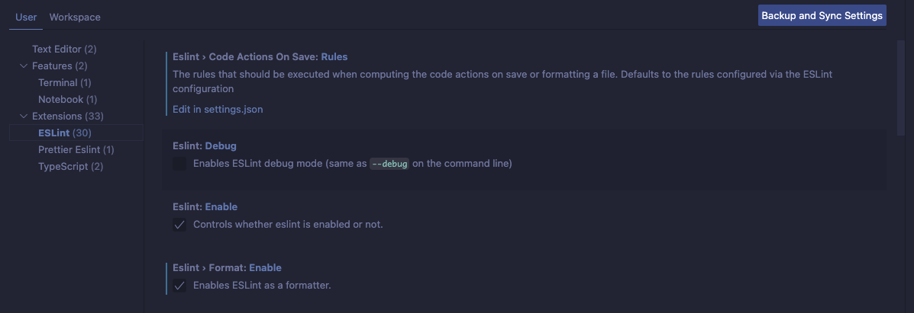
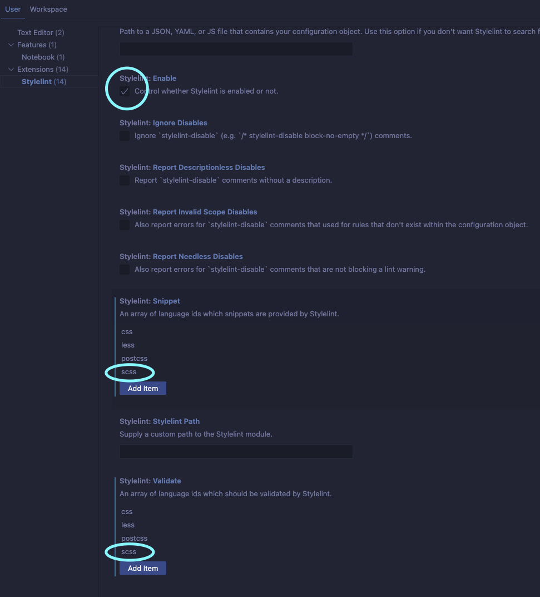
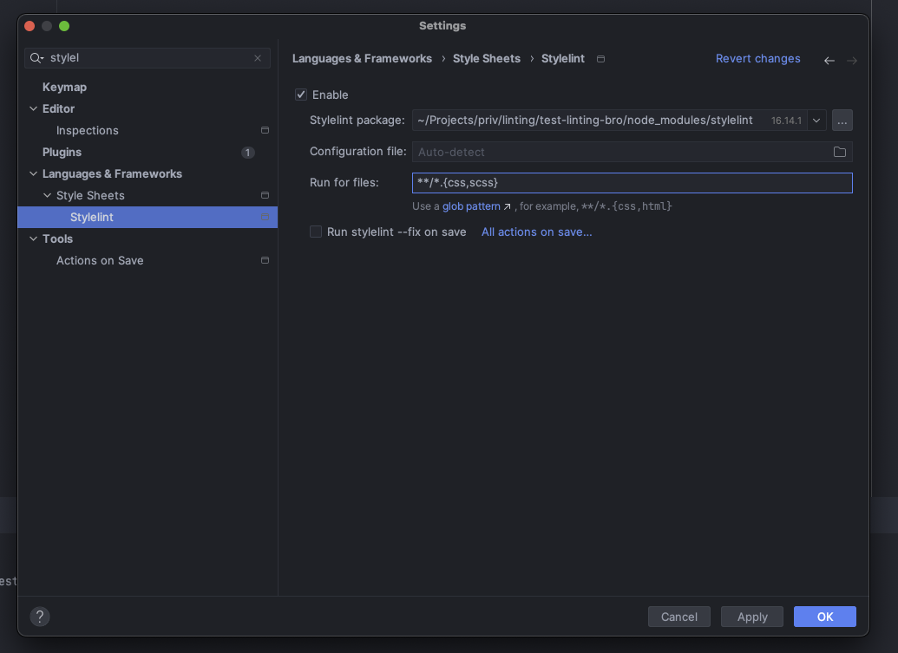

# IDE-setup

Be sure that you have added the `.editorconfig`.

## vs-code

1. Remove or disable prettier plugin
2. Install [ESLint plugin](https://marketplace.visualstudio.com/items?itemName=dbaeumer.vscode-eslint)
3. Under `settings > Extensions > ESLint` check `Eslint` and `EsLint > Format`

4. Install [Stylelint](https://marketplace.visualstudio.com/items?itemName=stylelint.vscode-stylelint)
5. Under `settings > Extensions > Stylelint` check `Stylelint` and add `scss` to `Stylelint: Snippet` and `Stylelint: Validate`

## IntelliJ IDEA

1. Install stylelint plugin from marketplace
2. Add enable `scss` for stylelint plugin

